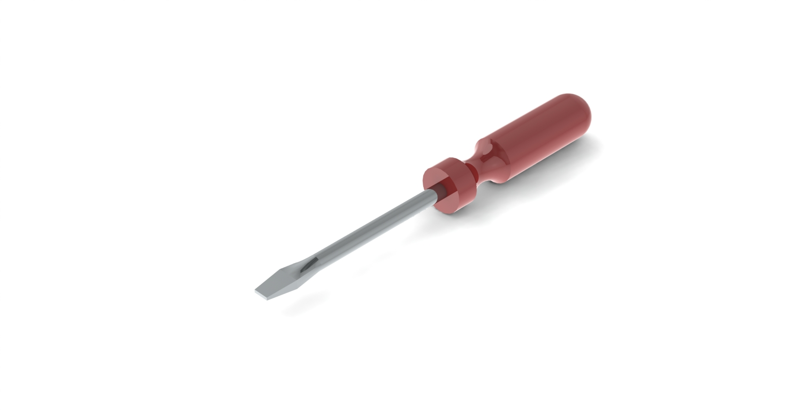
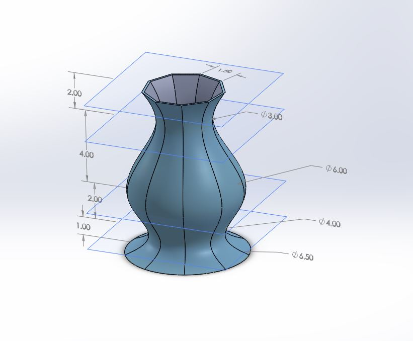
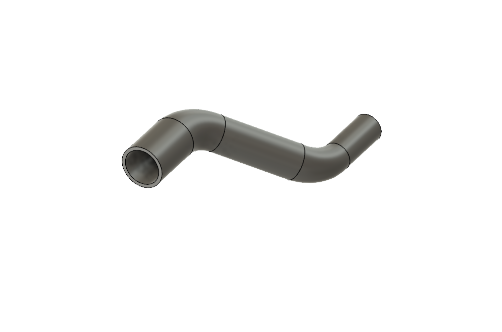
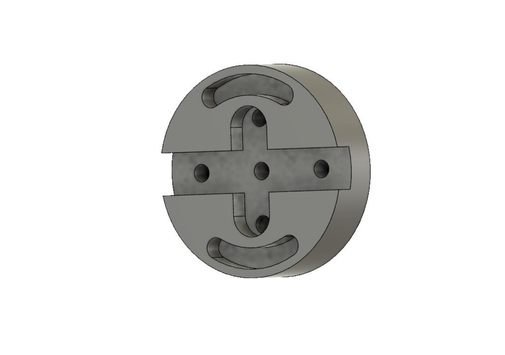
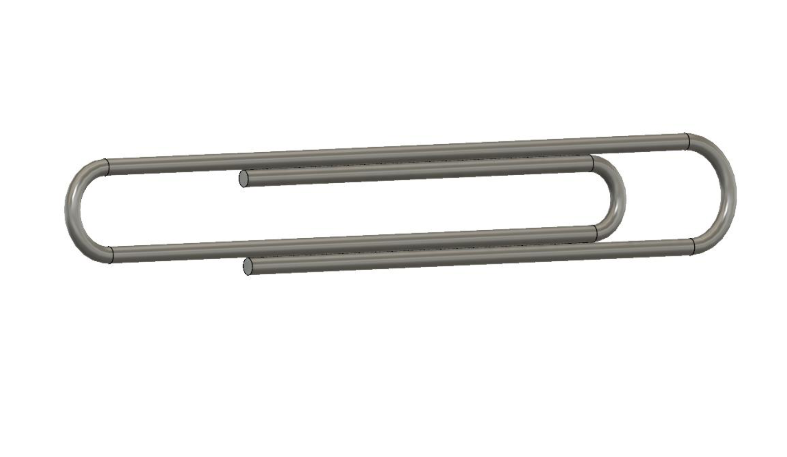
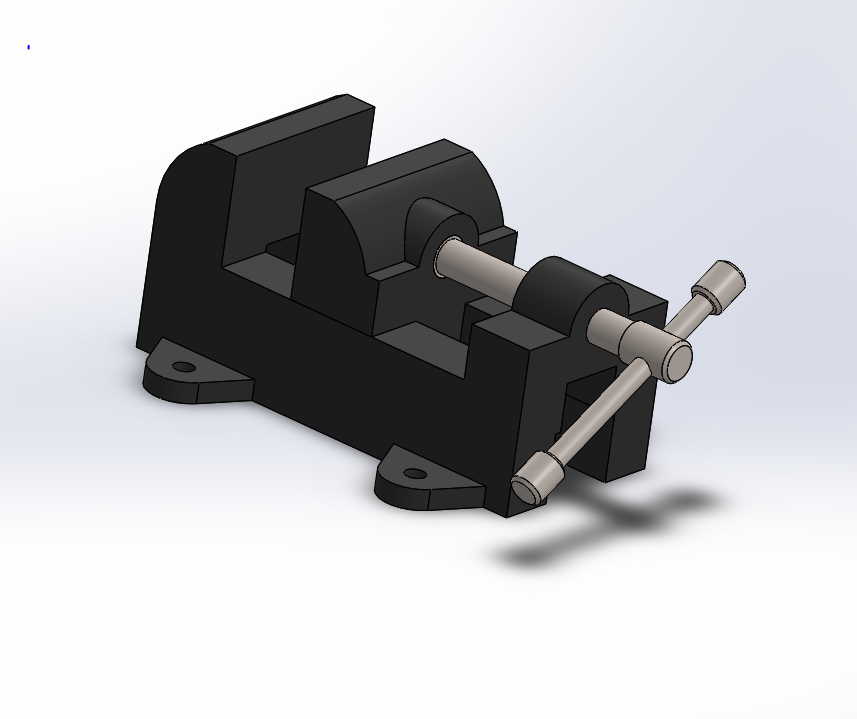
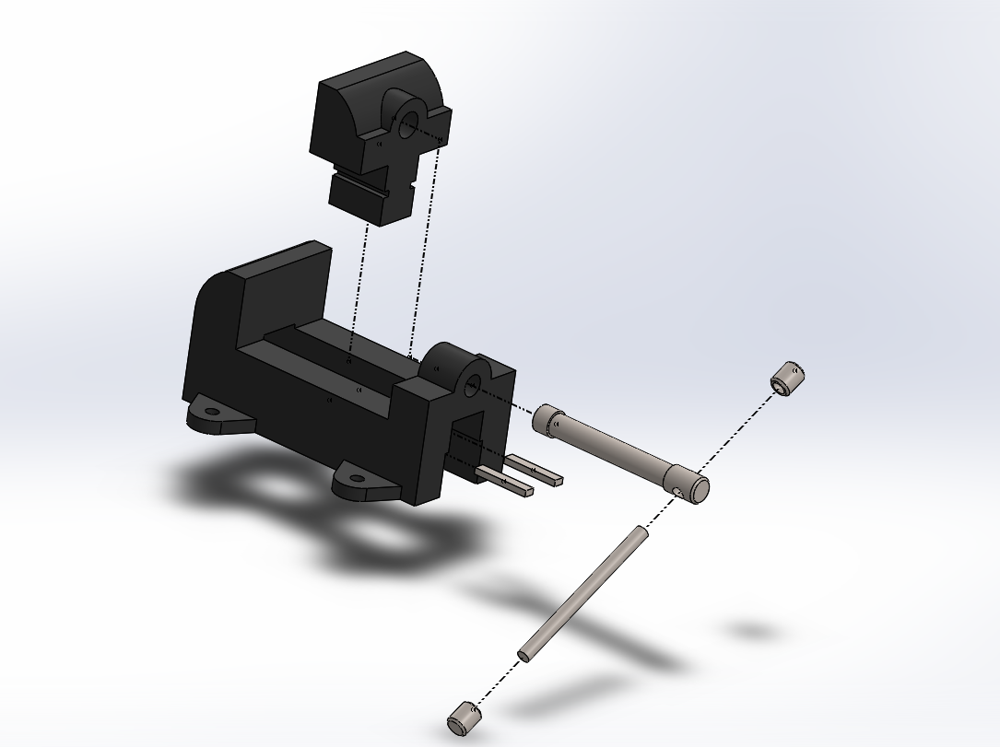
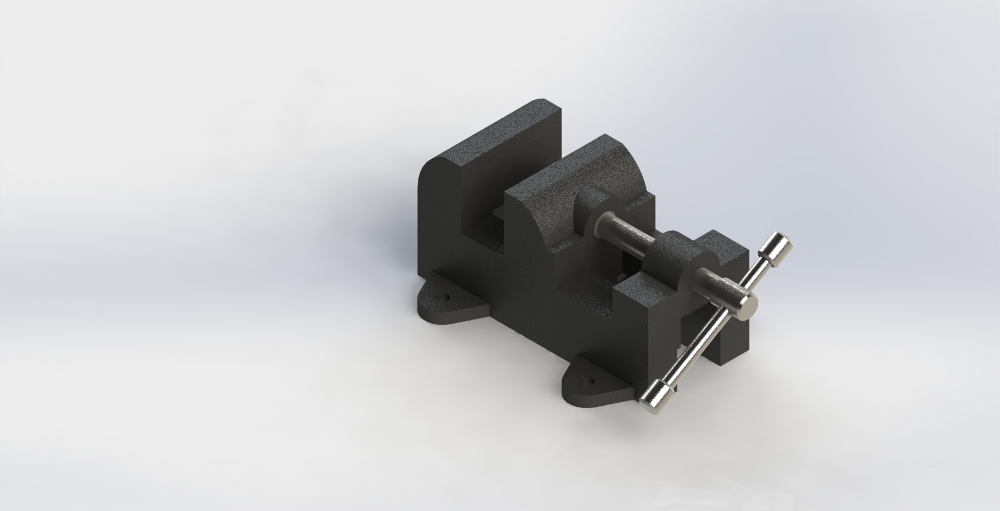

# Selected Works from 3D Modeling Class

## About This Project
I took Engineering 26: Three Dimensional Modeling for Design during Fall 2019. Below is a collection of selected works done by Solidworks from the class.

##### Rendered Screw Driver

##### Vase Design

##### A Wheel (Fusion 360)

##### Variable Cross Section Pipe (Fusion 360)

##### Machine part with slots (Fusion 360)

##### A Paper Clip (Fusion 360)

##### Vise Assembly View

##### Vise Exploded View

##### Rendered Vise
