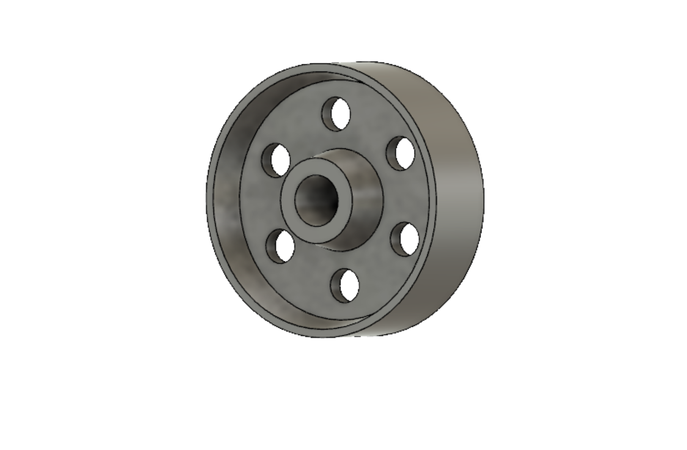

# Selected Works from 3D Modeling Class

## About This Project
I built a robot vehicle implementing with the pulse-width modulation, bluetooth communication, and differential wheels as one of my personal projects. This project is intended to investigate the application of differential drives on a robot vehicle. Furthermore, it can be served as a basic guideline for building robots of any kind since it is simple to build and easy to make further improvement. The fabrication cost is about $60.

Rendered Screw Driver

Vase Design

A Wheel (note: this is done by Fusion 360)

Vise Assembly View

Vise Exploded View

Rendered Vise
